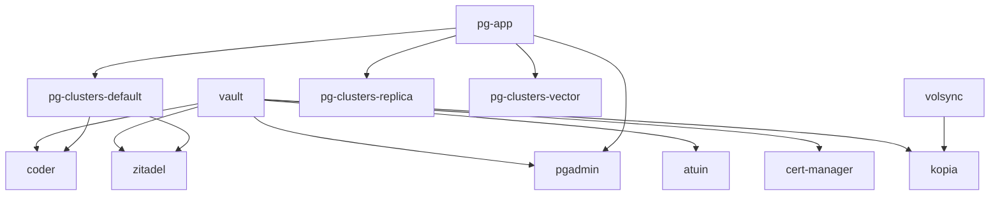

# Vault and PostgreSQL Dependencies Plan

## Overview
Apps that require vault (indicated by `vault:somesecretpath` in HelmRelease or CRD) should have `vault` in their kustomization's `dependsOn`.
Apps that require PostgreSQL (indicated by referencing pg_default) should have `pg-clusters-default` in their kustomization's `dependsOn`.

## Analysis Results

### Apps Requiring Vault Dependencies

| App | Location | Vault References | Current dependsOn |
|-----|----------|------------------|-------------------|
| dev-system/code-server/coder | [`kubernetes/apps/dev-system/code-server/coder/hr.yaml`](kubernetes/apps/dev-system/code-server/coder/hr.yaml:34) | `vault:secret/data/pg_default#HOST`, `vault:secret/data/pg_default#USER`, `vault:secret/data/pg_default#PASSWORD` | `[]` |
| home-system/atuin | [`kubernetes/apps/home-system/atuin/app/helmrelease.yaml`](kubernetes/apps/home-system/atuin/app/helmrelease.yaml:24) | `vault:secret/data/atuin#DB_URI` | `[]` |
| cert-manager/cert-manager | [`kubernetes/apps/cert-manager/cert-manager/app/clusterissuer.yaml`](kubernetes/apps/cert-manager/cert-manager/app/clusterissuer.yaml:10) | `vault:secret/data/cloudflare#EMAIL`, `vault:secret/data/cloudflare#CERT_TOKEN` | (no dependsOn field) |
| db/pg/pgadmin | [`kubernetes/apps/db/pg/pgadmin/hr.yaml`](kubernetes/apps/db/pg/pgadmin/hr.yaml:31) | `vault:secret/data/pg_default#PASSWORD` | (depends on pg-app via ks.yaml) |
| volsync-system/kopia | [`kubernetes/apps/volsync-system/kopia/app/helmrelease.yaml`](kubernetes/apps/volsync-system/kopia/app/helmrelease.yaml:39) | `vault:secret/data/volsync#KOPIA_PASSWORD` | depends on volsync |
| zitadel | [`kubernetes/apps/zitadel/app/hr.yaml`](kubernetes/apps/zitadel/app/hr.yaml:23) | `vault:secret/data/zitadel#MASTERKEY`, `vault:secret/data/pg_default#HOST`, `vault:secret/data/pg_default#USER`, `vault:secret/data/pg_default#PASSWORD` | `[]` |

### Apps Requiring PostgreSQL Dependencies

| App | Location | PG References | Current dependsOn |
|-----|----------|---------------|-------------------|
| dev-system/code-server/coder | [`kubernetes/apps/dev-system/code-server/coder/hr.yaml`](kubernetes/apps/dev-system/code-server/coder/hr.yaml:35) | `vault:secret/data/pg_default#HOST`, `vault:secret/data/pg_default#USER`, `vault:secret/data/pg_default#PASSWORD` | `[]` |
| zitadel | [`kubernetes/apps/zitadel/app/hr.yaml`](kubernetes/apps/zitadel/app/hr.yaml:35) | `vault:secret/data/pg_default#HOST`, `vault:secret/data/pg_default#USER`, `vault:secret/data/pg_default#PASSWORD` | `[]` |
| db/pg/pgadmin | [`kubernetes/apps/db/pg/pgadmin/hr.yaml`](kubernetes/apps/db/pg/pgadmin/hr.yaml:31) | `vault:secret/data/pg_default#PASSWORD` | depends on pg-app via ks.yaml |

## Required Changes

### 1. dev-system/code-server/coder
**File:** [`kubernetes/apps/dev-system/code-server/ks.yaml`](kubernetes/apps/dev-system/code-server/ks.yaml:19)

Add to the coder Kustomization's `dependsOn`:
- `vault` (namespace: `vault`)
- `pg-clusters-default` (namespace: `pg`)

### 2. home-system/atuin
**File:** [`kubernetes/apps/home-system/atuin/ks.yaml`](kubernetes/apps/home-system/atuin/ks.yaml:1)

Add to the atuin Kustomization's `dependsOn`:
- `vault` (namespace: `vault`)

### 3. cert-manager/cert-manager
**File:** [`kubernetes/apps/cert-manager/cert-manager/ks.yaml`](kubernetes/apps/cert-manager/cert-manager/ks.yaml:1)

Add to the cert-manager Kustomization:
- `dependsOn` field with `vault` (namespace: `vault`)

### 4. db/pg/pgadmin
**File:** [`kubernetes/apps/db/pg/ks.yaml`](kubernetes/apps/db/pg/ks.yaml:86)

Add to the pgadmin-app Kustomization's `dependsOn`:
- `vault` (namespace: `vault`)

Note: Already depends on `pg-app`, which is correct.

### 5. volsync-system/kopia
**File:** [`kubernetes/apps/volsync-system/kopia/ks.yaml`](kubernetes/apps/volsync-system/kopia/ks.yaml:1)

Add to the kopia Kustomization's `dependsOn`:
- `vault` (namespace: `vault`)

Note: Already depends on `volsync`, should add vault.

### 6. zitadel
**File:** [`kubernetes/apps/zitadel/ks.yaml`](kubernetes/apps/zitadel/ks.yaml:1)

Add to the zitadel-app Kustomization's `dependsOn`:
- `vault` (namespace: `vault`)
- `pg-clusters-default` (namespace: `pg`)

## Dependency Graph

## Implementation Order

1. ~~Update dev-system/code-server/coder kustomization~~ ✅ COMPLETED
2. ~~Update home-system/atuin kustomization~~ ✅ COMPLETED
3. ~~Update cert-manager/cert-manager kustomization~~ ✅ COMPLETED
4. ~~Update db/pg/pgadmin kustomization~~ ✅ COMPLETED
5. ~~Update volsync-system/kopia kustomization~~ ✅ COMPLETED
6. ~~Update zitadel kustomization~~ ✅ COMPLETED

## Implementation Status

All changes have been successfully applied:

### ✅ dev-system/code-server/coder
**File:** [`kubernetes/apps/dev-system/code-server/ks.yaml`](kubernetes/apps/dev-system/code-server/ks.yaml:29)
- Added `vault` (namespace: `vault`) dependency
- Added `pg-clusters-default` (namespace: `pg`) dependency

### ✅ home-system/atuin
**File:** [`kubernetes/apps/home-system/atuin/ks.yaml`](kubernetes/apps/home-system/atuin/ks.yaml:15)
- Added `vault` (namespace: `vault`) dependency

### ✅ cert-manager/cert-manager
**File:** [`kubernetes/apps/cert-manager/cert-manager/ks.yaml`](kubernetes/apps/cert-manager/cert-manager/ks.yaml:12)
- Added `vault` (namespace: `vault`) dependency

### ✅ db/pg/pgadmin
**File:** [`kubernetes/apps/db/pg/ks.yaml`](kubernetes/apps/db/pg/ks.yaml:98)
- Added `vault` (namespace: `vault`) dependency
- Note: Already depends on `pg-app`, which is correct

### ✅ volsync-system/kopia
**File:** [`kubernetes/apps/volsync-system/kopia/ks.yaml`](kubernetes/apps/volsync-system/kopia/ks.yaml:12)
- Added `vault` (namespace: `vault`) dependency
- Note: Already depends on `volsync`

### ✅ zitadel
**File:** [`kubernetes/apps/zitadel/ks.yaml`](kubernetes/apps/zitadel/ks.yaml:10)
- Added `vault` (namespace: `vault`) dependency
- Added `pg-clusters-default` (namespace: `pg`) dependency

## Notes

- All vault dependencies should reference the `vault` kustomization in the `vault` namespace
- All PostgreSQL dependencies should reference the `pg-clusters-default` kustomization in the `pg` namespace
- The vault kustomization itself depends on `banzai-operator` (from [`kubernetes/apps/vault/ks.yaml`](kubernetes/apps/vault/ks.yaml:32))
- The pg-clusters-default kustomization depends on `pg-app` (from [`kubernetes/apps/db/pg/ks.yaml`](kubernetes/apps/db/pg/ks.yaml:32))